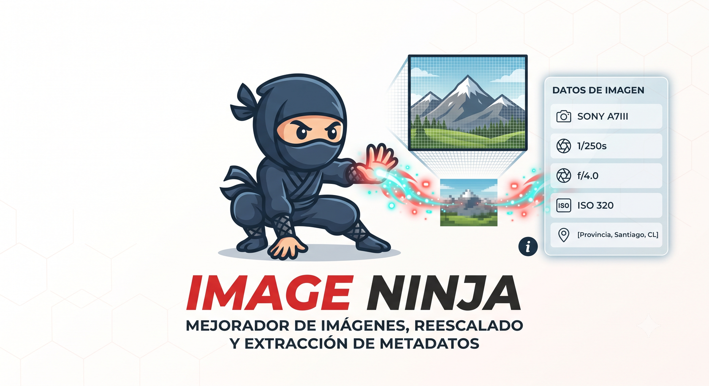

# ImageNinja

<p align="center">
  
</p>

<p align="center">
  <strong>Reescala y analiza tus fotos. Sin subir nada.</strong><br>
  <em>Mejorador con IA, reescalado a 4K y extractor de metadatos EXIF/XMP/GPS — 100% local, open source y portable.</em>
</p>

<p align="center">
  <a href="https://github.com/jaguayoara/image-ninja/releases/latest"></a>
  <a href="LICENSE"></a>
  <a href="https://github.com/jaguayoara/image-ninja/stargazers"></a>
</p>

---

**ImageNinja** es tu **taller de imagenes con IA** de escritorio. Corre 100% en tu computador — sin servidores, sin envios, sin costos.

### Que hace

| Herramienta | Que hace |
|---|---|
| 🎨 **Reescalar a 4K** | Convierte fotos pequenas en 4K UHD, 4K DCI o QHD. Tres niveles: **Rapida** (Lanczos, <1s), **Alta** (Real-ESRGAN x4), **Maxima** (denoise + IA + Lanczos + sharpen). Comparacion antes/despues, batch, PNG/JPG/WebP. |
| 🏷️ **Extraer metadatos** | Lee EXIF, IPTC, XMP, GPS, ICC profile. Muestra camara, lente, ISO, apertura, obturacion, focal, fecha, copyright, coordenadas GPS con link a Google Maps. Exporta a JSON. |

---

## Manifiesto

- **0 MB** de tus fotos sale de tu computador. El modelo se descarga una vez (67 MB), despues todo corre offline.
- **0 CLP** por imagen procesada. No hay plan free con limite, no hay upgrade, no hay "compra creditos".
- **0 cuenta** requerida. No hay login, no hay email, no hay analytics.

---

## Por que ImageNinja

- **IA Real-ESRGAN** — super-resolucion x4 con pipeline completo (denoise + IA + Lanczos + unsharp).
- **Privacidad total** — tus fotos nunca salen de tu PC.
- **Portable** — un solo `.exe` + carpeta `_internal/`. No requiere instalacion.
- **Open source** — MIT License. Usa, modifica y distribuye sin restricciones.
- **Batch** — sube varias imagenes y descarga un `.zip` con todo.
- **Windows / Mac / Linux** — el codigo es multiplataforma, el .exe publicado es Windows.

---

## Descarga

👉 **[Descargar la ultima version (Windows portable)](https://github.com/jaguayoara/image-ninja/releases/latest)**

Descomprime el `.zip` en cualquier carpeta y ejecuta `ImageNinja.exe`. No requiere instalacion ni Python.

> En el primer arranque Windows SmartScreen puede mostrar una advertencia. Es normal en apps open source sin code signing. Click en **"Mas informacion"** → **"Ejecutar de todas formas"**.

---

## Como funciona

1. **Elige una herramienta** desde la home — Reescalar o Extraer metadatos.
2. **Sube imagenes** arrastrandolas al area de drop, o haciendo click para seleccionar.
3. **Configura y procesa**:
   - **Reescalar**: elige `Rapida` / `Alta` / `Maxima`, target (4K UHD, 4K DCI, QHD o factor 2x/3x/4x) y formato de salida.
   - **Metadatos**: solo sube y el panel aparece automaticamente.
4. **Descarga** el resultado (PNG/JPG/WebP/ZIP para reescalar, JSON para metadatos).

---

## Modo IA (Real-ESRGAN)

El modo IA funciona **automaticamente** — ImageNinja detecta si el modelo esta descargado. Si no esta:

1. La UI muestra un boton **"Descargar modelo"** (~64 MB).
2. Click y se baja solo desde [xinntao/Real-ESRGAN](https://github.com/xinntao/Real-ESRGAN/releases).
3. La proxima vez que uses Maxima o Alta calidad, la IA ya esta lista.

Tambien podes bajar el modelo a mano y copiarlo a `models/`:
- `RealESRGAN_x4plus.pth` — fotos reales, mejor calidad (recomendado).
- `RealESRGAN_x2plus.pth` — mas rapido, x2.
- `RealESRGAN_x4plus_anime_6B.pth` — ilustraciones y anime.

Si no tenes el modelo, ImageNinja **no se rompe** — usa Lanczos automaticamente y te avisa.

---

## Como correrlo desde el codigo fuente

```powershell
# Clonar
git clone https://github.com/jaguayoara/image-ninja.git
cd image-ninja

# Setup (solo la primera vez)
python -m venv .venv
.\.venv\Scripts\Activate.ps1
pip install -r requirements.txt

# Arrancar (interfaz web)
python app.py
# Abre http://127.0.0.1:5050 en tu navegador

# O como app de escritorio con pywebview
python desktop.py
```

### Compilar el .exe

```powershell
.\build.bat
# Resultado: dist\ImageNinja\ImageNinja.exe + dist\ImageNinja\_internal\
```

Para empaquetar como `.zip` portable:

```powershell
Compress-Archive -Path dist\ImageNinja\* -DestinationPath ImageNinja-windows.zip -Force
```

---

## Stack

- **Backend**: Flask 3 + Pillow
- **IA (opcional)**: Real-ESRGAN + PyTorch
- **Frontend**: HTML + CSS vanilla + un poco de JS, sin frameworks
- **Desktop wrapper**: pywebview (WebView2 en Windows)
- **Empaquetado**: PyInstaller (`--onedir` para arranque instantaneo)

---

## Estructura del proyecto

```
ImageNinja/
├── app.py                  # Flask app
├── desktop.py              # pywebview launcher
├── build.bat               # PyInstaller script
├── core/
│   ├── upscaler.py         # Pipeline Real-ESRGAN + Lanczos
│   ├── metadata.py         # EXIF / XMP / IPTC / GPS / ICC
│   ├── cleanup.py          # Auto-cleanup de archivos temp
│   └── utils.py            # Constantes, paths, info de tools
├── templates/              # Jinja2 (base, index, tool, tool_metadata)
├── static/
│   ├── css/style.css       # Design system (Bricolage + Manrope + JetBrains Mono)
│   ├── js/                 # Dropzone, comparacion, descarga
│   └── img/                # ninja-mascot, favicon, og-image
├── assets/
│   ├── logo.png            # Logo original
│   ├── logo-readme.png     # Version liviana para README
│   └── logo-square.png     # Para og-image / favicon cuadrado
└── models/                 # Modelos IA (Real-ESRGAN se baja solo)
```

---

## Autor

Por **[Jorge Aguayo](https://github.com/jaguayoara)** (Chile).

ImageNinja es parte de la familia **Ninja**: herramientas pequenas, utiles, open source, que respetan tu privacidad.

---

## Licencia

MIT — ver [LICENSE](LICENSE).

Esto significa que puedes usar, modificar, distribuir y vender el codigo libremente, siempre que mantengas el aviso de copyright.
